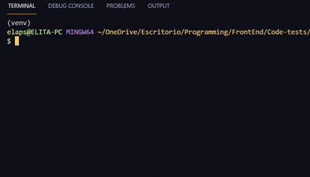

## About The Project

The disease and gene command utility is a command line developed with Python with two functionalities for retrieving information about diseases and genes.

It was developed with the DISGENET plus API.

## Getting Started

### Prerequisites

- [Python 3](https://www.python.org/)
- [Pip](https://pypi.org/project/pip/)

### Installation

1. Clone the Repo (or Unzip the .zip file)

```sh
git clone https://github.com/mariela-plaza/medbioinformatics-code-test
```

2. Go to the root directory of the project

3. Create Virtual Environment

```sh
python -m venv VIRTUAL_ENVIRONMENT_NAME
```

4. Activate Virtual Environment

```sh
# macOS / linux
source VIRTUAL_ENVIRONMENT_NAME/bin/activate
```

```
# Windows
VIRTUAL_ENVIRONMENT_NAME\Scripts\activate
```

5. Install Dependencies

```sh
pip install -r requirements.txt
```

6. Get an API KEY from [https://beta.disgenetplus.com/](https://beta.disgenetplus.com/)

7. Enter your API Key in the apiKey.json file in place of "TYPE_YOUR_API_KEY"

```json
{
  "apiKey": "TYPE_YOUR_API_KEY"
}
```

## Usage

From the project directory, open a terminal and use the CLI app as follows:

1. For **disease** information

```sh
# Substitute the DISEASE_IDENTIFIER with an UMLS disease code. Examples: C0036341, C0002395, C0013264
python main.py disease DISEASE_IDENTIFIER
```

2. For **gene variants** information

```sh
# Substitute the GENE_HGNC_SYMBOL with an HGNC gene symbol. Examples: PRDX1, AGPAT5, LCLAT1
python main.py gene GENE_HGNC_SYMBOL
```



## Author

- Mariela Plaza
